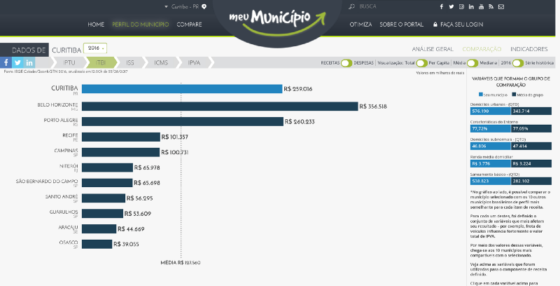
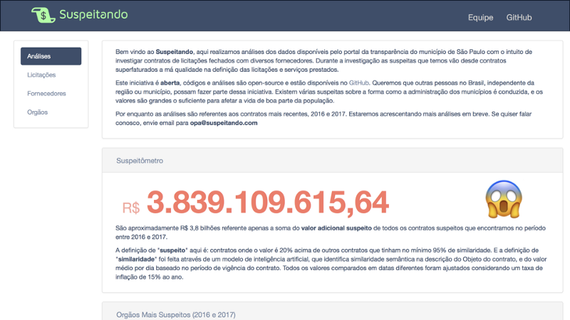

_Post originalmente publicado na [Operação Serenata de Amor](https://medium.com/serenata/o-que-importa-s%C3%A3o-as-perguntas-958131b235aa)._

---

No dia 4 de setembro de 2014, o então presidente Barack Obama nomeou [Megan Smith](https://en.wikipedia.org/wiki/Megan_Smith) como CTO da Casa Branca, um cargo que podemos traduzir como _diretora de tecnologia_. No mesmo ato nomeou [Alex Macgillivray](https://twitter.com/amac) como braço direito de Megan. Esses dois profissionais não tinham uma carreira consolidada na política: ela era uma executiva no Google, ele, advogado no Twitter. O filósofo [Luciano Floridi](https://www.oii.ox.ac.uk/people/luciano-floridi/) diz que esse momento é crucial para entendermos o mundo onde vivemos hoje: essas nomeações são o marco inicial de uma nova forma de poder — um novo [_poder cinza_](https://link.springer.com/article/10.1007/s13347-015-0206-y), como ele chama.

Mas o que isso tem a ver com a [Operação Serenata de Amor](https://serenata.ai)? Para dar um _spoiler_, digo que eu considero esse _poder cinza_ um dos principais fatores que fazem a Serenata se destacar dentre diversos outros projetos de tecnologia cívica. Mas vamos aos poucos.

## O que é esse poder cinza?

Quando falamos de coisas como [Era da Informação](https://pt.wikipedia.org/wiki/Era_da_informa%C3%A7%C3%A3o) estamos pressupondo que a informação em si é uma nova fonte de poder. Quem tem mais informação tem mais poder. E, seguindo essa lógica, quem detém os meios que produzem as informações são as pessoas e instituições mais poderosas, certo?

Talvez não. Um olhar mais cauteloso pode nos trazer algumas provocações. Por exemplo, como Luciano Floridi mesmo diz:

> Se informação e os meios para produzí-la fossem o novo poder cinza, então jornais não estariam ameaçados, o jornalismo não seria uma profissão em crise, editoras, livrarias e bibliotecas não estariam fechando as portas. A Wikipédia seria mais poderosa que o Facebook ou que o Twitter. Editoras ditariam as regras para a Amazon. A indústria da música teria revolucionado a Apple. Hollywood influenciaria o Netflix. Jornais teriam imposto suas próprias vontades ao Yahoo! e ao Google.

Se [informação é o novo petróleo](https://www.economist.com/news/leaders/21721656-data-economy-demands-new-approach-antitrust-rules-worlds-most-valuable-resource), por que jornais, gravadoras e livrarias — que produzem uma parcela enorma das informações que acessamos todos os dias — estão sucumbindo perante Facebook e Google, por exemplo — que não produzem informação nenhuma praticamente?

Para entender essa aparente contradição, temos que entender que o que importa na tal _Era da Informação_ não é a informação em si, mas a dinâmica em que a informação se insere: **uma dinâmica de perguntas e respostas**. E é nessa dinâmica que está o _poder cinza._ Essa expressão é escolhida para diferenciar do _poder_ em si, mais uma vez, nas palavras do próprio Luciano Floridi:

> O poder cinza é o poder de influenciar. Mas às vezes o poder cinza é erroneamente tido como o poder que influencia o poder. Não é bem assim. Ele é o poder que influencia aqueles que influenciam o poder.

<iframe width="560" height="315" src="https://www.youtube.com/embed/3SAPuLnwCKM" frameborder="0" allow="accelerometer; autoplay; encrypted-media; gyroscope; picture-in-picture" allowfullscreen></iframe>

## Perguntas e respostas

Há algumas décadas, antes da internet conectar pessoas ao redor do mundo, muito se falava do fenômeno de comunicação em massa: algumas emissoras de rádio e TV, junto com os principais jornais e revistas, tinham o poder de nos bombardear diariamente com diversas informações. Era como se fosse um temporal de respostas (cujas perguntas não importavam muito). Independente dos gostos pessoais, as notícias eram as mesmas para uma população imensa. Os anúncios, os temas, tudo massificado.

No entanto o poder desses meios de comunicação estava menos no conteúdo da notícia em si, mas principalmente no que se noticiava ou deixava de noticiar. Por exemplo: todo dia o Jornal Nacional escolhe o que põe como manchete, o que comenta em uma nota curta dos apresentadores, e o que nem chega a virar notícia. Independente da informação, essa espécie de curadoria é que é o maior poder de Globos, Folhas de S. Paulo etc.

A informação em si (_deputado tal propôs tal projeto de lei_) não é o que faz os meios de comunicação em massa poderosos, mas o poder de escolher o que noticiar e com qual importância. Em outras palavras _deputado tal propõe tal projeto de lei_ é uma resposta, é informação. Mas a informação que vale (muito) mais é a pergunta _o que é notícia hoje?_

O poder da Era da Informação, pensando assim, não está na informação em si, mas está nas pessoas que tem como decidir quais as perguntas vão ser respondidas com a abundância de informações que temos ao nosso alcance nos dias de hoje.

## Tecnologia cívica

Em paralelo a tudo isso tivemos no Brasil muita coisa acontecendo, dentre elas [portais de transparência](http://www.portaltransparencia.gov.br/) e [lei de acesso a informações](http://www.acessoainformacao.gov.br/assuntos/conheca-seu-direito/a-lei-de-acesso-a-informacao). [O Brasil é hoje um dos países com o governo mais transparente no mundo](https://index.okfn.org/place/?filter-table=Brazil). Isso significa que o governo abre muitos dados sobre seu próprio funcionamento, que o governo se prontifica a divulgar dados, que os cidadãos participam desse processo, entre outras coisas.

Em teoria isso parece dizer que nós, cidadãos, temos fácil acesso a todos esses dados. Na prática seria uma espécie de _self-service_, um banquete de informações. É claro que devemos exigir mais pratos nesse banquete. Trabalhos como o do [Turicas](https://twitter.com/turicas) junto à [Escola de Dados](https://escoladedados.org/) e a grupos de jornalismo de dados tem mostrado que tem muito dado público aberto mas inacessível.

<blockquote class="twitter-tweet" data-lang="en">
O libertador de dados: como e por que um programador (<a href="https://twitter.com/turicas?ref_src=twsrc%5Etfw">@turicas</a>) se dedica a abrir dados públicos enclausurados em formatos ruins <a href="https://t.co/40PuJ7KP4u">https://t.co/40PuJ7KP4u</a>
&mdash; Abraji (@abraji) <a href="https://twitter.com/abraji/status/966381159147081728?ref_src=twsrc%5Etfw">February 21, 2018</a></blockquote>

<blockquote class="twitter-tweet" data-lang="en">
Top 10 <a href="https://twitter.com/hashtag/ddj?src=hash&amp;ref_src=twsrc%5Etfw">#ddj</a>: <a href="https://twitter.com/abraji?ref_src=twsrc%5Etfw">@abraji</a> profiles Alvaro Justen, nicknamed <a href="https://twitter.com/turicas?ref_src=twsrc%5Etfw">@turicas</a>, an activist and collaborator of free software projects since 2004, highlighting his informative <a href="https://twitter.com/hashtag/data?src=hash&amp;ref_src=twsrc%5Etfw">#data</a> projects <a href="https://t.co/Xw1HPCy64m">https://t.co/Xw1HPCy64m</a> <a href="https://t.co/zNa7k6NCfX">pic.twitter.com/zNa7k6NCfX</a>
&mdash; GIJN (@gijn) <a href="https://twitter.com/gijn/status/969694594844823553?ref_src=twsrc%5Etfw">March 2, 2018</a></blockquote>

O trabalho dele mostra que “nós programadores temos privilégio sobre os leigos, porque dependendo do formato só nós conseguimos acessar os dados, mesmo que eles estejam disponíveis” — como o Turicas mesmo comentou comigo. Aquela facilidade no acesso aos dados que foi prometida, que se tinha em mente com a Lei de Acesso a Informação, nem sempre é uma realidade.

No entanto, de forma geral, não sabemos quais perguntas podemos (e devemos) responder com esses dados que já são abertos e acessíveis. A maioria dos projetos de tecnologia cívica são apenas _remix_ de informação, ou seja, as mesmas respostas, os mesmos dados, com roupagem diferente. O que falta para a tecnologia cívica aumentar ainda mais seu impacto é tomar para si o protagonismo de _fazer perguntas_.

Ao meu ver é isso que está por trás dos projetos que mais me animam na área. Claro que coloco a Serenata como exemplo aqui, mas não é só ela. Na mesma pegada de usar os dados públicos (informação) para **fazer perguntas**, sempre cito outros projetos como, por exemplo, [As Diferentonas](https://play.google.com/store/apps/details?id=com.ionicframework.diferentonas906569&hl=pt_BR), [Meu Município](https://meumunicipio.org.br/) e [Suspeitando](http://www.suspeitando.com.br/). Esses são alguns projetos de tecnologia cívica fazendo perguntas — e o ato de fazer perguntas é, de fato, a fonte do _poder cinza_ do qual falávamos.

## O poder da tecnologia cívica

Quando Luciano Floridi compara editoras, livrarias e jornais com as superpotências da tecnologia como Google e Facebook ele não está negando a Era da Informação, mas chamando a atenção para o fato de que a informação em si não resulta em nenhum poder.

A riqueza dessas empresas surge quando elas usam a informação que tem em mãos para responder as perguntas que elas mesmas se propõe: qual anunciante quer ser visto na página de uma pessoa de x anos de idade, moradora de cidade y, que gosta disso, daquilo e de não sei mais o quê. É usar os enormes banco de dados para saber o que vai [deter o usuário mais tempo na sua timeline](https://en.wikipedia.org/wiki/Attention_economy), e quem pagaria para aparecer especificamente para esse usuário.

Da mesma forma, ao termos muitas informações sobre nossos governos, temos que tomar as rédeas das perguntas, e não só ficar dando roupagem novas para os dados. Claro que, mesmo com a Lei de Acesso a Informação, ainda existe o problema da inacessibilidade dos dados. E obviamente isso prejudica nossa capacidade de fazer perguntas que possam impactar a sociedade de forma mais efetiva. Mas em paralelo, podemos trabalhar com o que já temos em mãos.

As Diferentonas e o Meu Município pegam dados do orçamento público e comparam em grupos de cidades semelhantes em diversos aspectos, como cada uma delas gasta. Isso permite não só uma nova visualização dos dados que já eram públicos, mas que o cidadão pondere as razões de seu município ter mais ou menos sucesso em cada umas das políticas que a prefeitura implementa. Esses projetos jogam no ar a pergunta sobre como prefeitas e prefeitos estão gerindo a cidade — e isso é muito mais valioso do que um simples acesso aos dados do orçamento.

O Suspeitando utiliza dados sobre as licitações para se perguntar onde houve superfaturamento nesses processos. Ele propõe a pergunta diretamente, o que é muito mais valioso do que uma planilha gigante listando tudo que foi licitado por um órgão ou outro.

A Serenata, por sua vez, usa dados públicos se perguntando onde pode ter ocorrido um uso indevido. Começamos pela [Cota para Exercício da Atividade Parlamentar](http://www.camara.gov.br/cota-parlamentar/), mas pretendemos avançar com essa pergunta em outros bancos de dados muito em breve.

Esses projetos são os que, na minha opinião, melhor expressam o _poder cinza_, como diz Luciano Floridi aplicado à tecnologia para inovação cívica: usamos dados públicos para fazer perguntas, não só para dar respostas. Isso destaca a Serenata e alguns outros projetos nesse meio. E é essa proatividade com os dados públicos que realmente possibilita que a sociedade civil cause impacto em governos e estados. É nisso que acreditamos e é com isso que trabalhamos na Serenata!
